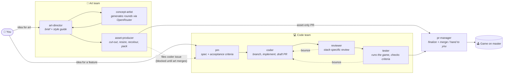
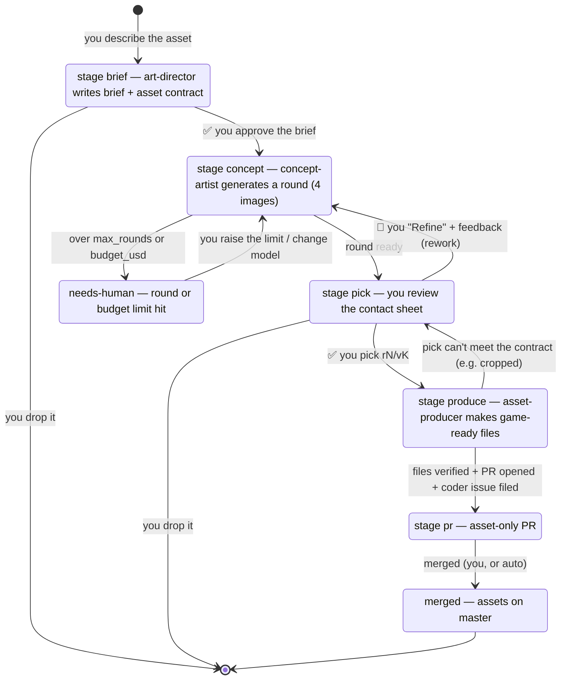
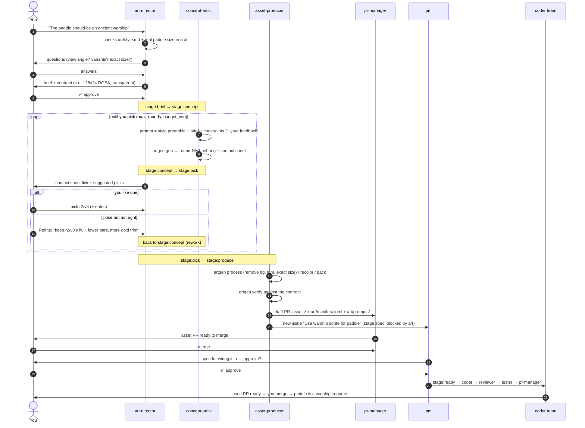
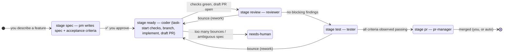

# Agent workflow — code team + art team

How work moves from an idea to something playable in the game, who does what,
and where **you** step in. Everything runs on one shared beads (`br`) queue;
each agent only picks up issues carrying its `stage:*` label, does its step,
and moves the label on.

- Start the code team: `agent-team up` (or `agent-team up pm coder` to start small)
- Start the art team: `agent-team up art` (needs `OPENROUTER_API_KEY` exported first)
- Watch them: `agent-team attach` (Ctrl-b n / p to switch windows) · queue counts: `agent-team status`
- Per-repo settings (gates, budgets, model, sizes): `.claude/workflow.yaml`

---

## 1. The big picture

Two teams, one queue. The art team **makes the files**; the code team
**wires them into the game**. They meet at two points: the asset PR goes
through the same pr-manager, and the asset-producer files a coder issue that
stays blocked until the art is merged.



---

## 2. Your touchpoints (the only places you have to act)

| # | When | Who asks you | What you do |
|---|---|---|---|
| 1 | New art idea | art-director | Answer a few questions, **approve the brief** (what it is, sizes, variants) |
| 2 | Each concept round is ready | art-director | Open the contact sheet, **pick** `rN/vK`, **refine** with feedback, or **drop** |
| 3 | Asset PR ready | pr-manager | **Merge** it (if `gates.merge: human`) |
| 4 | Coder issue for wiring the art | pm | **Approve the spec** (always required) |
| 5 | Code PR green | pr-manager | **Merge** it |
| — | Anything escalated (`needs-human`) | pm / art-director | Decide: raise a limit, clarify, or drop |

Everything between those points runs on its own.

---

## 3. Art pipeline in detail

### 3a. Stages



### 3b. One asset end to end (example: the paddle as an ancient warship)



### 3c. Where the files end up

| What | Where | In git? |
|---|---|---|
| Every concept round (all variations, prompts, costs) | `art/concepts/<issue>/round-N/` + `index.html` contact sheet | No (gitignored — scratch) |
| Style guide | `art/style.md` | Yes |
| Final game-ready files | `assets/sprites/…`, `assets/ui/…`, `assets/backgrounds/…` | Yes (asset PR) |
| How each asset was made (source pick, model, processing) | `art/manifest.toml` | Yes |
| The exact prompt of the picked round | `art/prompts/<issue>-rN.txt` | Yes — lets you regenerate later |

Contact sheet from Windows (auto-refreshes every 30 s):
`\\wsl.localhost\Ubuntu-24.04\home\frede\projects\breakout\art\concepts\<issue>\index.html`

---

## 4. Code pipeline (for completeness)



---

## 5. Getting good results from AI art (new-to-this guide)

**Nail the style guide before anything else.** `art/style.md` has a *Prompt
preamble* that is prepended to every prompt — that single paragraph is what
keeps the paddle, the bricks and the backgrounds looking like one game. When
results drift, fix the preamble (with the art-director), not each brief.

**Concepts are cheap; be decisive.** A round is 4 images for a few cents.
Defaults: 4 variations, max 5 rounds, $2 per issue — then it escalates to you.
Pick "good enough to produce" rather than chasing perfection; the producer
cleans up edges and sizing.

**Write feedback like a director, referencing images.** The concept-artist
passes your picks back as reference images, so name them:
- 👍 "Keep **r2/v3**'s silhouette, make the prow taller, drop the sail."
- 👍 "Like **r1/v2**'s colours with **r2/v4**'s shape."
- 👎 "Make it better" / "more epic" — gives the model nothing to change.

**Why the concepts have a magenta background.** Prompts ask for a single
object on flat `#FF00FF` (or green for pink subjects). That makes background
removal reliable — the producer keys it out to transparency. It's expected;
don't pick against it.

**Generate one base, derive the variants.** For the titan-rank bricks, brief
*one* brick design and list the colours as variants. The producer makes the
colour versions with `artgen recolor` from the palette — they'll match
exactly, which separate generations never will.

**Know the weak spots.** Current image models are poor at: legible text
(put text in the game UI, not the art), exact pixel sizes (the producer
resizes), and consistent animation frames (brief frames one at a time using
the previous frame as a reference, or keep animation in code: bob, tilt,
tint). Big painted backgrounds and single objects are their strength.

**Your earlier experiments are useful.** The `enoch_*` and `steelbreak_*`
images already in `art/` can be fed back as references — mention them in a
brief ("match the lighting of `art/enoch_concept/enoch_keyart_hero.png`").

**One-time groundwork.** The first art brief also files a pm task "Load
sprite assets" (assets dir, trunk `copy-dir` for the web build, hot reload
on native). Approve that early so asset PRs have somewhere to land.

---

## 6. Quick reference

```bash
# start / stop
export OPENROUTER_API_KEY=...          # before starting the art team
agent-team up art                      # art-director + concept-artist + asset-producer
agent-team up pm coder reviewer tester pr-manager
agent-team status                      # counts per stage, who's holding what
agent-team down

# talk to the teams (in their tmux windows)
#   art-director: "I want the paddle to be an ancient warship"
#   pm:           "Add a pause menu"

# artgen by hand (the agents use these)
ARTGEN="python3 ~/.claude/skills/art-pipeline/scripts/artgen.py"
$ARTGEN models                         # image models + prices
$ARTGEN cost --issue <id>              # spend so far on an issue
$ARTGEN process in.png out.png --bg key --trim --size 128x24
$ARTGEN verify out.png --size 128x24 --alpha

# beads
br list -l art                         # all art issues
br list -l needs-human                 # things waiting on you
```

**Web smoke test.** CI's `web-smoke` job loads the built site in headless
Chromium. It checks that the game reaches the menu and starts a level with no
console errors, panics or failed requests, and Pages only deploys if it
passes. The tester runs the same check locally with `scripts/web-smoke.sh`
(see `scripts/README.md`); it isn't a required check yet.

**Agent permissions.** `.claude/settings.json` is committed, so every
worktree gets the same allowlist (cargo, trunk, br, git, `gh pr` without
merge, the native-run scripts, xdotool, the asset server). It denies
`gh pr merge` and registers `.claude/hooks/guard-bash.py`, which blocks force
pushes (`--force-with-lease` is allowed on task branches, never to
master/main), `git reset --hard`, `git clean -f`, whole-tree discards,
`rm -r` outside the repo and /tmp (and on .git, .beads, / or ~), and
`br delete`, with a one-line reason. Per-worktree `.claude/settings.local.json`
keeps only role or machine rules, e.g. `pr-merge *` for the pr-manager.
`gh api` is left to prompt: a glob can't restrict it to GET requests.

**Beads sync.** Only the pm commits `.beads/issues.jsonl`, and with
`beads.sync_commit: trunk-direct` it does so straight to master as
`chore(beads): sync ...` (no sync PR). If the push is rejected because master
moved, it merges with `br sync --merge`, rebases and retries once. A push
that touches only `.beads/**` doesn't start CI or redeploy Pages
(`paths-ignore` in `.github/workflows/build.yml`). PRs always run the
required checks.
