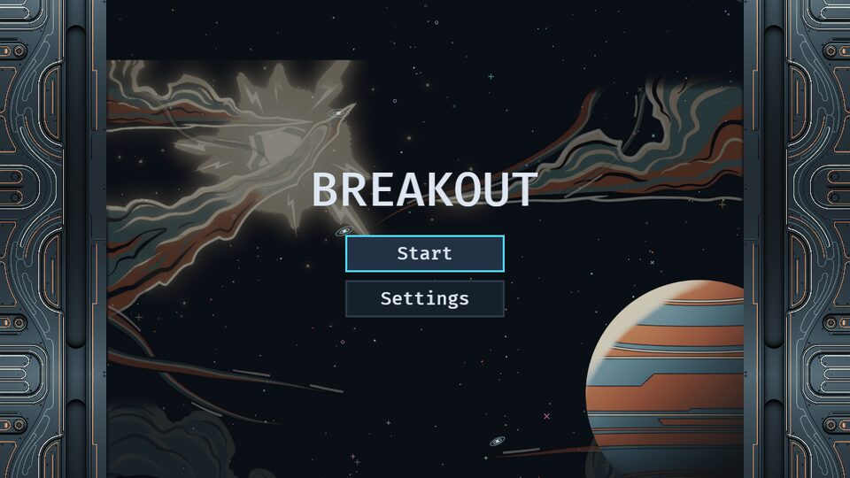
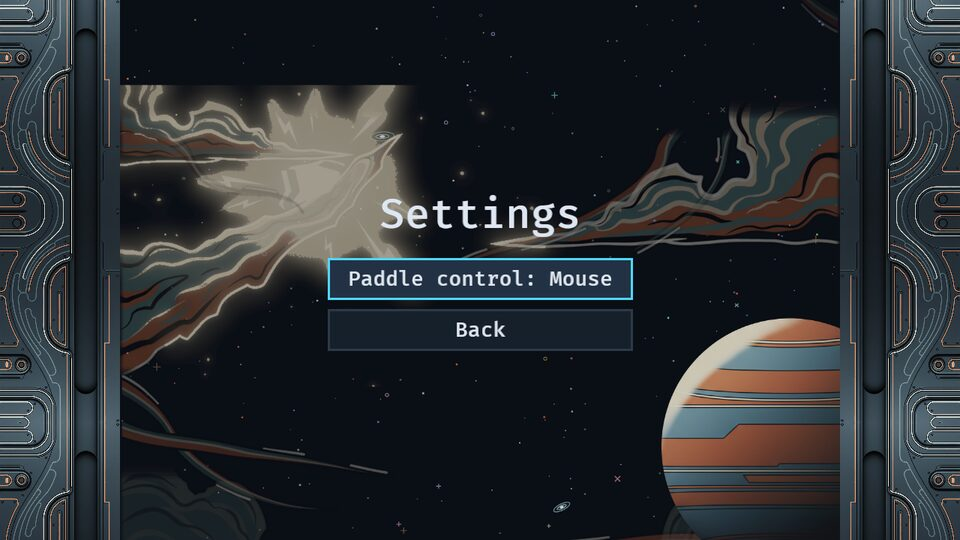
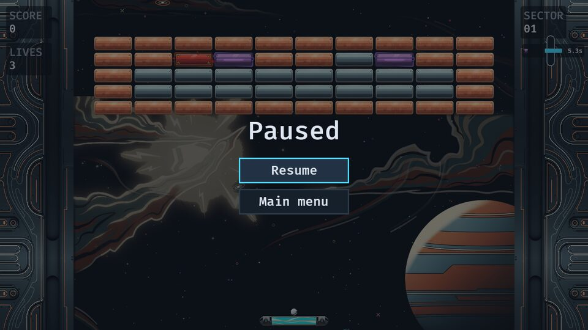
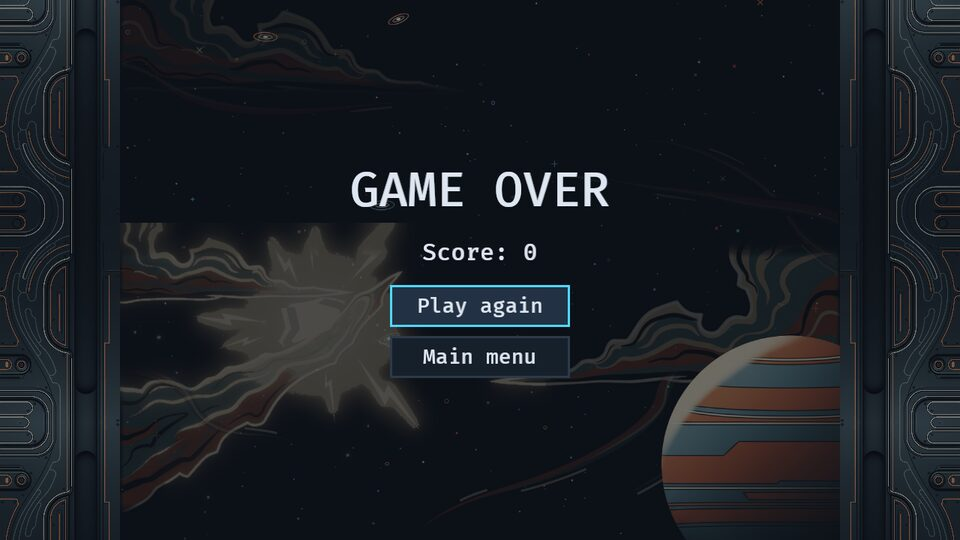
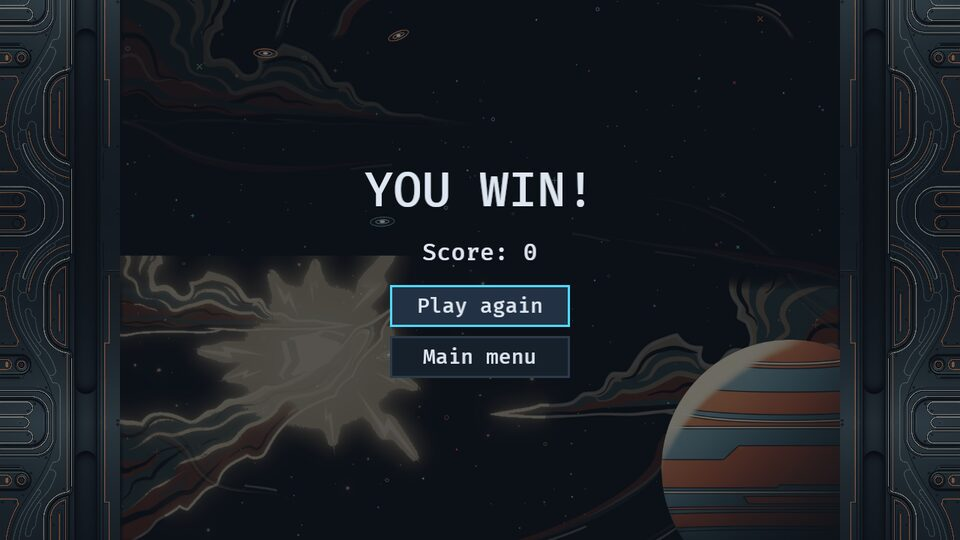
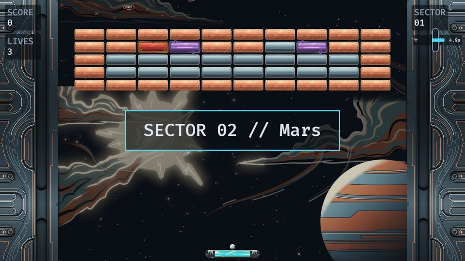
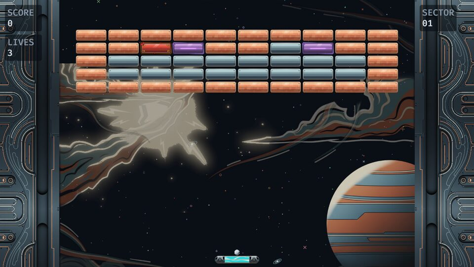
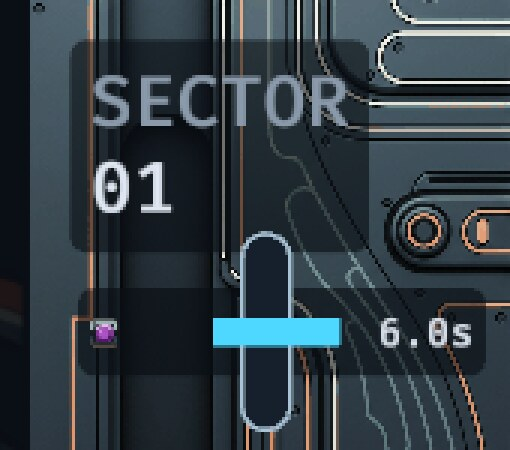
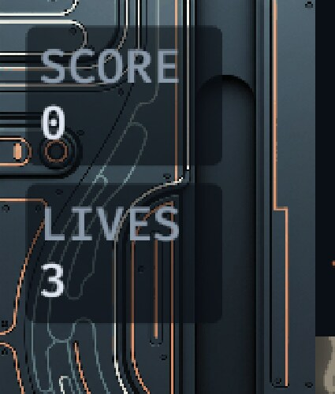
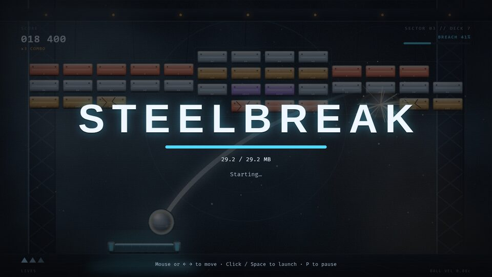

# UI direction

The plan for reskinning and animating the game's UI (epic `sim-3rd`). It has five parts:

1. **Inventory:** what every screen is today.
2. **Dynamic-UI catalogue:** the moving UI we could add, with a suggested first wave.
3. **Technical decisions:** the choices every build task depends on, each with a recommendation.
4. **Proposed build slices:** the tasks to file, in order.
5. **Style guide gap:** what `art/style.md` must allow before the art team can draw UI.

The art team's whole-screen mockups (`sim-3rd.2`) run in parallel. This doc settles the *how*, and the picks from the mockups settle the *look*.

Facts are as of master `fc673ef` (2026-10-10). Code is cited as `path:line`. Bevy APIs are cited from the vendored source,
relative to `~/.cargo/registry/src/index.crates.io-1949cf8c6b5b557f/`, and we're on bevy **0.19.1**.

**Summary.** Two kinds of UI exist today:
- **Menus and the SECTOR card** are bevy_ui (`Node` / `Button` / `Text`).
- **The HUD, the capsules and their plates** are world-space (`Text2d`, `Sprite`, `Mesh2d`), drawn in the painted side panels.

Nothing in the UI moves (except the HTML splash's CSS), no font file ships (every glyph is Bevy's embedded FiraMono), and no UI image exists.

The recommendations, in one breath:
- a ~100-line in-house tween on `EasingCurve` + `Time<Real>`;
- keep the HUD in world space but size plates from measured text;
- two OFL fonts (about 180 KB);
- 9-slice art authored at 2× with `max_corner_scale = 0.5`;
- a data-driven `UiSkin` loaded from a `.skin.ron` file;
- screen changes hidden behind a global wipe overlay, so `DespawnOnExit` stays as it is;
- card animation driven by the card's own virtual-time timer;
- a `ReducedMotion` resource seeded from the browser's `prefers-reduced-motion`.

---

## 1. Inventory

Screenshots are from the web build (`trunk build --release`, headless Chromium at 1280×720, so `UiScale` = 1.0). A throwaway spike
added debug keys to reach the SECTOR card, a capsule and the end screens. Nothing from it is in this PR.

### Main menu



- **Built by** `spawn_main_menu` on `OnEnter(AppState::MainMenu)` (`src/menu/main_menu.rs:17`). It uses the widget kit in
  `src/menu/mod.rs`:
  - `menu_screen` (`:85`): a full-screen centred column with `DespawnOnExit`.
  - `menu_list` (`:103`): children stretch to the widest button.
  - `heading` (`:115`).
  - `menu_button` (`:128`): min width 240, height 56, 3 px border.
- **Kind:** bevy_ui.
- **Colours:** coded. Headings are `INK`. Buttons are `BUTTON_NORMAL` / `BUTTON_HOVERED` / `BUTTON_PRESSED`, with border `BORDER_NORMAL`, or
  `BORDER_FOCUSED` (= `EMITTER`, cyan) when focused (`src/theme.rs:81-85`). No images.
- **Font:** embedded FiraMono. Title 72 px ("BREAKOUT", `main_menu.rs:21`); labels 28 px. The web page calls the game
  "STEELBREAK" (`index.html:98`), so the two titles disagree today.
- **Motion:** none. `update_button_colors` (`mod.rs:252`) swaps colours instantly.
- **Keyboard:** Up/W and Down/S move focus with wrap; Enter/Space activates (`mod.rs:202-250`).
- **Reskin notes:**
  - Navigation finds the list through the focused button's parent, so buttons must stay **direct children** of `MenuList`.
  - The label must stay the button's `Children[0]`. The settings toggle (`settings.rs:40`) and every test helper
    (`mod.rs:282-347`) rely on it.

### Settings



- **Built by** `spawn_settings` (`src/menu/settings.rs:18`). A 56 px heading, the paddle-control toggle (relabels its own
  `Children[0]`), and Back. Esc also goes back (`:49`).
- **Kind:** bevy_ui; same kit, colours and font as the main menu.
- **Motion:** none.
- `sim-tce.3` adds a reset-progress confirm dialog here.

### Pause



- **Built by** `spawn_pause_menu` on `OnEnter(PlayState::Paused)` (`src/menu/pause.rs:18`). The root has `BackgroundColor(OVERLAY_DIM)`
  (`#0c1118` at 75 %). It holds a 56 px "Paused" heading, then Resume and Main menu.
- **Kind:** bevy_ui.
- **Motion:** none.
- **Space→Resume:** Space activates the focused Resume button, and the same press doesn't serve the ball. `launch_ball` only
  runs in `PlayState::Playing` (`src/main.rs:163-171`). The state change lands next frame, by which point Space is no longer
  `just_pressed`. This is a scheduling side effect, not an explicit guard, and it's pinned by
  `launch_is_ignored_while_paused_and_the_ball_stays_anchored` (`src/ball/tests.rs:114`). **Any transition work must keep
  it.**
- The pause root covers the SECTOR card only because it spawns later. No `ZIndex` is used anywhere.

### Game over / win

| Lost | Won |
|---|---|
|  |  |

- **Built by** `spawn_game_over` on `OnEnter(AppState::GameOver)` (`src/menu/game_over.rs:18`). "GAME OVER" or "YOU WIN!" at 64 px,
  "Score: N" at 32 px, then Play again and Main menu. R is a shortcut for Play again (`src/run.rs:245`).
- **Kind:** bevy_ui on `OVERLAY_DIM`.
- **Motion:** none. The run's entities are gone the moment the state changes, so the board doesn't stay visible behind the
  dim.

### SECTOR card



- **Built by** `spawn_sector_card` (`src/campaign.rs:119`), from `on_level_cleared` (`:145`). A full-screen centred root holds one
  panel (padding 48×24, 3 px `EMITTER` border, `HUD_PLATE` background) with a 48 px `SECTOR 02 // Mars` heading.
- **Kind:** bevy_ui; it reuses `menu::heading`.
- **Timing:** `LevelTransition.timer` is 2.0 s (`SECTOR_CARD_SECS`, `:34`). `advance_after_card` ticks it on `Res<Time>`
  (virtual), and only in `PlayState::LevelClear` (`:76-81`), so pausing freezes it.
- **Lifetime:** `DespawnOnExit(AppState::InGame)` plus an explicit despawn when the timer ends (`:184`). It is not scoped to
  `LevelClear`, so pausing doesn't delete it.
- **Motion:** none. It pops in and out.
- `sim-tce.2` adds a GALAXY card next to it.

### HUD



- **Built by** `spawn_hud_line` (`src/run.rs:204`), called three times from `spawn_run_entities` (`:159-182`): SCORE and LIVES top-left,
  SECTOR top-right. `update_hud` (`:258`) writes the values.
- **Kind:** **world-space.**
  - Each line is a `Text2d` label (`Anchor::TOP_LEFT`, z 1.0) with one `TextSpan` child that holds the value.
  - A separate `BackingPlate` entity sits behind it.
  - It scales with the camera's `AutoMin` projection, not with `UiScale`.
- **Colours:** labels `LABEL`, values `INK`.
- **Font:** FiraMono at `HUD_FONT_SIZE = 24 × GAME_SCALE` (36 world units, `:41`).
- **Monospace maths:** plate size is computed, not measured:
  ```rust
  const HUD_CHAR_WIDTH: f32 = HUD_FONT_SIZE * 0.6;   // FiraMono advance (run.rs:53)
  const HUD_LINE_HEIGHT: f32 = HUD_FONT_SIZE * 1.2;  // Bevy's default line height (run.rs:54)
  ```
  `hud_text_rect` (`:188`) is `max(6 label chars, 6 digits) × HUD_CHAR_WIDTH` by two lines. **A new font breaks this.**
- **Motion:** none. Numbers just change.
- `sim-tce.2` adds the galaxy to the HUD.

### Power-up capsules



- **Built by** `spawn_capsule` (`src/powerups/capsules.rs:258`). `sync_capsules` (`:205`) rebuilds the views from `ActiveEffects` every
  frame. The children are:
  1. plate
  2. 32 px icon `Sprite` (skinned with `powerup.png`)
  3. outline `Mesh2d`
  4. pill `Mesh2d`, holding the fill `Sprite`
  5. `Text2d` label `6.0s`
- **Kind:** world-space, top of the right panel under SECTOR. Parts are found by marker, not by child index.
- **Colours:** `CAPSULE_PILL`, `CAPSULE_OUTLINE`, `CAPSULE_FILL`, `CAPSULE_WARN`, `POWER_UP`.
- **Motion:**
  - The fill shrinks with the effect's time left.
  - In the last 2 s it turns amber and blinks at 4 Hz, with the phase taken from the time left, not a clock (`:38-42`).
  - Pausing freezes it, because `ActiveEffects` ticks only while `Playing`.
  - Capsules appear, disappear and re-slot instantly.
- **Monospace maths:** `TEXT_CHAR_WIDTH = TEXT_SIZE × 0.6` and `LABEL_CHARS = 4` (`:69-71`) size the plate.
  Unlike the HUD, sizes are not multiplied by `GAME_SCALE`.
- **Bug found while capturing:** the pill outline and the dark pill draw **vertical**, crossing the horizontal fill bar. That's
  what the close-up shows. `Capsule2d` extends along Y (`bevy_math-0.19.1/src/primitives/dim2.rs:2191`), and
  `capsules.rs:194` never rotates it. Filed as **`sim-o73`**.
- `sim-mz1` (open PR #127) gives each power-up kind its own capsule icon.

### Backing plates



- **Built by** `BackingPlate { size }` (`src/plate.rs:26`). `dress_plates` (PostUpdate, `:75`) gives each new plate a rounded-rect
  `Mesh2d` (radius 8, 6 segments per corner) with one shared `ColorMaterial(HUD_PLATE)` (`#0a0f15` at 80 %).
- **Kind:** world-space mesh. No border, no image, no motion.
- The mesh is built once, for plates `Without<Mesh2d>`. **Changing `size` later doesn't rebuild it**, which matters if plates
  are ever to grow or animate.

### Web splash



- **Built by** `index.html` and `web/loader.js`. A fixed overlay with `splash.jpg` at 35 % opacity, an "STEELBREAK" `<h1>` (system-ui
  700, cyan text-shadow), a progress bar and a controls hint.
- **Kind:** HTML/CSS; the only UI motion in the game today.
  - The bar fill has a 0.2 s width transition, and an indeterminate sweep runs at 1.2 s.
  - The splash fades over 0.5 s on `.done`.
  - `@media (prefers-reduced-motion: reduce)` disables the transitions and slows the sweep (`index.html:89-92`).
- **Hand-over:** `src/web_splash.rs`'s `hand_over_splash` (`:81`) waits until every handle in `GameSprites::all()` and the tuning
  file are loaded or failed, then 3 more settled frames (cap 600 frames). It then dispatches `steelbreak-ready`, and
  `loader.js` (`:54`) fades the splash. **Fonts aren't in the wait set, because none are loaded.**

### Shared facts

- **`UiScale`:**
  - `ui_scale_for = min(w / 1920, h / 1080) × 1.5` (`src/view.rs:48`). That gives 1.0 at 1280×720 and 1.5 at 1920×1080, with no clamp.
  - UI is effectively authored in **1280×720 logical px**.
  - Nothing outside `view.rs` reads `UiScale`.
- **Colours** all come from `src/theme.rs`; there are no hard-coded colours in UI code.
- **Precedents:**
  - `src/parallax.rs` animates on `Time<Real>` as pure functions of elapsed time (`:358`, `:418`), so it keeps moving on
    every screen, including pause.
  - `src/powerups/collapse.rs` has the only easing: a hand-written `u*u` ease-in and a half-sine bounce (`:225-230`) on
    virtual time.
  - Nothing uses `EasingCurve` / `EaseFunction` yet.

---

## 2. Dynamic-UI catalogue

The four kinds the user chose for the epic. Each item has its effort (**S** ≤ ½ day, **M** 1–2 days, **L** more) and its impact.
**★ = suggested first wave**: five items that each make a screen you see every run feel alive, and between them exercise the
tween helper, the card widget, the HUD and the camera.

Game-feel numbers (shake pixels, hit-stop ms) aren't decided here. They come from the feel briefs in `docs/vision/briefs/`, per the
pm's polish process. `brick-break.md` and `paddle-hit.md` already exist as stubs.

### Transitions

| # | Item | Screen | Description | Effort | Impact | |
|---|---|---|---|---|---|---|
| T1 | Menu wipe | main menu ↔ settings, → run | A graffiti-stroke wipe covers the screen, the state changes underneath, then the wipe uncovers (≈ 200 + 200 ms). | M | Med | |
| T2 | **Card slam** | SECTOR / GALAXY card | The card scales in from 1.4× with `BackOut` and a slight tilt, holds, then slides off sideways in its last 0.3 s. | S | High | ★ |
| T3 | Fade to game over | game over / win | The board stays visible while the dim ramps up over ≈ 0.5 s and the title drops in, then buttons appear. | M | High | |
| T4 | Pause fade | pause | The dim fades in over ≈ 120 ms and the panel scales from 0.9×. Resume stays instant. | S | Med | |
| T5 | Run intro | start of a run | The HUD plates slide in from the panel edges and the board drops in row by row. | M | Med | |
| T6 | Title draw-on | splash → main menu | The title's line-art strokes draw on once after the splash hands over. | S | Low | |

### Reactive HUD

| # | Item | Screen | Description | Effort | Impact | |
|---|---|---|---|---|---|---|
| H1 | **Score tick + pop** | HUD | The score counts up to its new value (≈ 0.3 s) and pops to 1.25× with `BackOut`. Big gains pop harder. | S | High | ★ |
| H2 | **Lives flash** | HUD | On a lost life the value flashes warning colour and shakes for ≈ 0.4 s. A gained life pulses. | S | High | ★ |
| H3 | Capsule slide | capsules | A new capsule slides in from the panel edge, and an expired one slides out while the rest close the gap smoothly instead of re-slotting. | S | Med | |
| H4 | Capsule warn pulse | capsules | In the 2 s warning, the capsule also pulses in scale in time with the existing blink. | S | Low | |
| H5 | Sector flip | HUD | The SECTOR number flips or rolls to the new value when a level starts. | S | Low | |
| H6 | Streak tag | HUD | A "×3" tag pops beside the score for quick consecutive breaks. Needs a combo rule first (pm). | L | Med | |

### Living menus

| # | Item | Screen | Description | Effort | Impact | |
|---|---|---|---|---|---|---|
| M1 | **Focus glow + wobble** | all menus | The focused button gets a pulsing neon glow (`BoxShadow`) and a slow ±2° wobble. Focus changes ease rather than swap. | S | High | ★ |
| M2 | Animated title | main menu | The title breathes, and highlights run along its outline. It leaves a logo slot, since the name is undecided. | M | Med | |
| M3 | Attract mode | main menu | A ghost ball bounces across a dimmed board behind the menu. Parallax already runs. | L | Med | |
| M4 | Press squash | all menus | A pressed button squashes to 0.92× and springs back. | S | Med | |
| M5 | Hover sparks | all menus | A few world-space sparks fly off the focused button's corners. | M | Low | |

### Game feel / juice

| # | Item | Screen | Description | Effort | Impact | |
|---|---|---|---|---|---|---|
| G1 | **Screen shake** | gameplay | Camera shake on explosive blasts and a lost life, with strength by event. Numbers come from the feel briefs. | S | High | ★ |
| G2 | Hit-stop | gameplay | Freeze virtual time for 40–60 ms when a tough brick breaks or a chain blast fires. | M | High | |
| G3 | Flash | gameplay | A brief white or colour flash over the well on level clear and big chains. | S | Med | |
| G4 | Paddle squash | gameplay | The paddle squashes on a ball hit (`docs/vision/briefs/paddle-hit.md`). | S | Med | |
| G5 | Clear slow-mo | gameplay | The last brick's break plays at ½ speed for ≈ 0.3 s before the card. | M | Med | |

**First wave:** T2, H1, H2, M1, G1. T3 and G2 are the strongest second-wave picks.

---

## 3. Technical decisions

### 3.1 Tweening

**Recommendation: an in-house `Tween` helper on bevy_math's easing curves**, a new `src/tween.rs` of roughly 100 lines plus
tests. It would provide:
- a component holding an `EasingCurve<T>` (or an `EaseFunction`), a duration, an elapsed time and a clock choice;
- one system per animated property: `UiTransform` scale and rotation, `Transform`, `TextColor`, `BackgroundColor`
  and `ImageNode` alpha;
- `Time<Real>` by default.

**What bevy 0.19.1 already gives us:**
- `EasingCurve::new(start, end, EaseFunction)`: `bevy_math-0.19.1/src/curve/easing.rs:299`, `:312`, domain 0–1.
- `EaseFunction`: `easing.rs:435`. It covers Back, Elastic, Bounce, Cubic, Sine, Steps and more, with In/Out/InOut. It
  implements `Curve<f32>` itself (`:1350`), so `EaseFunction::BackOut.sample_clamped(t)` works directly.
- `Ease` is implemented for every `f32` vector space, `Rot2`, `Quat` and the colour structs such as `Srgba` and `Oklaba`
  (`easing.rs:87-104`, `bevy_color-0.19.1/src/lib.rs:264`). The `Color` enum is not, so ease colours in `Srgba` and convert.

**Clock rule:**
- Menus, HUD reactions and transitions use **`Time<Real>`**. Pausing pauses `Time<Virtual>`
  (`src/particles/mod.rs:273`, `:350`), and the pause menu itself must still animate.
- Anything tied to a gameplay timer reads that timer instead. See 3.7.

**Alternatives:**
- **bevy_tweening 0.16.0** (2026-06-28, `bevy ^0.19`, default features bevy_sprite / bevy_ui / bevy_text). The most mature.
  It has lenses, sequences and completion events. Worth adopting if we outgrow the helper, i.e. if we need many chained
  sequences and callbacks.
- **bevy_tween 0.13.0** (2026-07-03, `bevy ^0.19.0` via `bevy_time_runner 0.7`) and **bevy_easings 0.19.0** (2026-06-24, bevy
  ^0.19). Both are fine. None of the three pulls in rayon or `multi_threaded`, so they should build for wasm. Not compiled
  here.
- **bevy_animation** (built in, enabled through `common_api`: `bevy-0.19.1/Cargo.toml:2722`). It has `AnimatableProperty`
  and `animated_field!` (`bevy_animation-0.19.1/src/animation_curves.rs:190`, `:794`). It can't animate `Val`, so no node
  sizes or `UiTransform.translation` (`animatable.rs:82-200`). It also needs a player, a clip asset and a graph per
  animation, which is heavy for one-shot UI pops.

**Why:**
- Our needs are a handful of one-shot pops, fades and slides, and the curves are already in bevy.
- An extra dependency is one more crate that has to catch up before every bevy upgrade.
- The helper is small enough to replace with bevy_tweening later.

### 3.2 HUD and capsules: world space or bevy_ui

**Recommendation: keep the HUD and capsules in world space. Replace the monospace maths with measured text, and the `Mesh2d`
plates with 9-sliced sprites.**

- **They belong to the painted frame panels**, which are world sprites at fixed world coordinates (`src/frame.rs`, `src/world.rs`).
  In world space they scale and letterbox with the playfield for free (`AutoMin`). In bevy_ui they'd need world-to-screen
  mapping and would drift from the frame art at odd aspect ratios.
- **Particles:** bevy_enoki 0.7.0 renders only in the 2D world pass (`Transparent2d`, `bevy_enoki-0.7.0/src/material.rs:47`,
  `:221-262`) and has no bevy_ui integration. Sparks off a score pop or a capsule are trivial in world space and awkward over
  UI, which would need a second camera with `RenderLayers` above the UI.
- **9-slice exists in both:**
  - `Sprite` with `SpriteImageMode::Sliced(TextureSlicer)`: `bevy_sprite-0.19.1/src/sprite.rs:168`.
  - `ImageNode` with `NodeImageMode::Sliced`: `bevy_ui-0.19.1/src/widget/image.rs:158`.
- **Text effects** exist in both: `Text2dShadow` (`bevy_sprite-0.19.1/src/text2d.rs:143`) and `TextShadow`
  (`bevy_ui-0.19.1/src/widget/text.rs:146`).
- **Monospace maths:** size plates from the laid-out text, `TextLayoutInfo.size` (`bevy_text-0.19.1/src/pipeline.rs:474`,
  `:486`), instead of `0.6 em`. Fix the widest value with a reserved string ("000000"), so the plate doesn't twitch as the
  score grows.
  - **Caveat:** headless tests run on `MinimalPlugins`, where text isn't laid out. The plate code needs a fallback estimate,
    and the tests must assert containment rather than exact sizes.
- **Plates** must rebuild when `size` changes: `Changed<BackingPlate>`, or a sliced sprite whose `custom_size` simply changes.
  Today the mesh is built once.

**Alternative: move the HUD and capsules to bevy_ui.**
- **Gains:** flex layout (no hand maths), `UiTransform` pops, `BoxShadow` glows, gradients, and one styling path shared with
  the menus.
- **Costs:** frame alignment, particles under the UI, and rewriting `run.rs`, `capsules.rs`, `plate.rs` and their tests.

Revisit this if the mockups put HUD elements outside the panels.

### 3.3 Fonts

**Recommendation: one display face and one HUD/body face, both shipped under `assets/fonts/` and set explicitly everywhere.**

Candidates were measured from `google/fonts` (2026-10-10). "Digits equal" means the 10 digit advances are identical. None of these fonts has a
`tnum` OpenType feature, so equal-width digits must be the font's default.

| Role | Font | Licence | Size | Digits equal | Notes |
|---|---|---|---|---|---|
| Display | **Bungee** + Bungee Outline | OFL | 116 KB each | no | Bold urban signage, very legible at 28 px. The Outline cut gives the line-art look; layer it over a fill colour. |
| Display | Sedgwick Ave Display | OFL | 136 KB | no | A true graffiti handstyle. Great for titles and cards, too loose for button labels. |
| Display | Knewave | OFL | 31 KB | no | Brush, tiny. Only 210 glyphs, so ASCII only. |
| Display | Permanent Marker | Apache-2.0 | 72 KB | no | Marker hand. Different licence; fine, but note it. |
| HUD / body | **Oxanium** (variable wght) | OFL | 42 KB | **yes** | Squared sci-fi that suits the steel frame. Weight axis for emphasis; digits don't jiggle as the score ticks. |
| HUD / body | JetBrains Mono (variable) | OFL | 182 KB | yes | Fully monospace, so today's maths would keep working, but it reads as "code". |
| HUD / body | Space Mono | OFL | 97 KB | yes | Monospace, retro. |

- **Pick:** recommend **Bungee (+ Outline) for display and Oxanium for HUD/body**, about 275 KB in all. That's against a 25 MB
  release wasm and 4.9 MB of assets, so it's negligible. Sedgwick Ave Display is the alternative if the mockups go more
  hand-drawn. The final pick follows the user's mockup choice (`sim-3rd.2`).
- **Bevy API:** `TextFont.font` is a `FontSource`, `Handle` by default (`bevy_text-0.19.1/src/text.rs:282`, `:376`).
  - Weight needs a variable font (`FontWeight`).
  - `LetterSpacing` (`text.rs:1041`) gives tracking for the display face.
  - `FontFeatures` can request `tnum` (`text.rs:786`, `:840`), but only if the font has it.
- **No outline stroke:** bevy text has no per-glyph stroke, in either UI or 2D. The graffiti outline comes from an outline
  font cut, or from stacked shadows.
- **Fallback:** the embedded FiraMono stays as the fallback (`default_font` is on through bevy's defaults,
  `bevy-0.19.1/Cargo.toml:2762`), so a missing font file still shows text. On wasm there are no system fonts.
- **Effect on width maths:** `run.rs:53-54` and `capsules.rs:69-71` must go, replaced by measured text as in 3.2. Oxanium's
  equal digits keep the value from jittering, but `SECTOR` and `LIVES` are no longer the same width per char.
- **Splash:** fonts become `Handle<Font>`s in the skin's wait set (3.5), so the menu never flashes in FiraMono first. The splash
  `<h1>` can use the same Bungee file through `@font-face`, which ties into the web splash slice.

### 3.4 9-slice contract

A 9-slice image is cut into 3×3 parts. The corners stay fixed, the edges stretch along one axis and the centre stretches both ways, so one
small frame image can skin a button of any size. Think of a picture frame: the corners are carved, the sides are plain moulding.

**Bevy's types (bevy_sprite 0.19.1):**
- `TextureSlicer { border: BorderRect, center_scale_mode, sides_scale_mode, max_corner_scale }`:
  `src/texture_slice/slicer.rs:15-23`.
- `BorderRect { min_inset, max_inset }`: `border_rect.rs:10`. Note the field names; they aren't left/top/right/bottom.
- `SliceScaleMode::{Stretch, Tile { stretch_value }}`: `slicer.rs:29`.

**How it scales:**
- **UI:** the slicer receives the node's *logical* size (`bevy_ui_render-0.19.1/src/ui_texture_slice_pipeline.rs:598-601`), and the scale factor
  is window DPI × `UiScale` (`bevy_ui-0.19.1/src/update.rs:159`). So **one texture pixel of border is one logical pixel**,
  i.e. 1.5 screen pixels at 1080p.
- **Corner scale** is `min((node_size / image_size).min_element(), max_corner_scale)` (`ui_texture_slice_pipeline.rs:736-738`;
  sprites: `slicer.rs:60`). A node smaller than the *whole source image* shrinks its corners. Corners never grow past
  `max_corner_scale`.

**The contract:**

| Item | Rule |
|---|---|
| Authoring scale | **2×.** Insets are in 2× texture pixels and the slicer uses `max_corner_scale = 0.5`, so corners show at 1× logical size and are downsampled (crisp) up to `UiScale` 2. |
| Size limit | `image_size × 0.5 ≤` the smallest node it skins. Buttons are 56 logical px tall, so a button frame is **≤ 112 px tall** at 2×. Panels are larger and freer. |
| Insets | Per asset, all four sides, multiples of 2. Typical button: 16 px (8 logical); panel: 32 px. The line art and corner ornaments sit entirely inside the insets. |
| Min size | A node is never smaller than `(left + right, top + bottom) × 0.5` logical px. |
| Centre | Flat colour or transparent: **no gradient or texture across a stretch axis.** `center_scale_mode = Stretch`. |
| Sides | `Stretch` for plain lines. `Tile { stretch_value: 1.0 }` only for patterned edges (rivets, hatching), whose pattern must tile seamlessly. |
| Look check | Preview at `UiScale` 1.0, 1.25 and 1.5, and at 56×240 (button), 300×500 (panel) and 600×120 (card). |
| World space | The same images work as `Sprite` with `SpriteImageMode::Sliced` for the HUD plates. There, "logical px" is world units: `GAME_SCALE` 1.5 × logical, and the camera's `AutoMin` scale replaces `UiScale`. Use the same 2× / 0.5 rule. |
| Where insets live | In the **skin file** (3.5): `assets/ui/<skin>.skin.ron`, next to each image path. Data, so a per-galaxy skin can bring its own frames. `art/manifest.toml` gets a `slice = [l, t, r, b]` field on the asset entry, so the pipeline can verify it. The two must agree, and the skin slice's test can check that. |

**What artgen needs** (the art-pipeline skill: today it has no slicing support at all):
- **`process --slice l,t,r,b`:** keep exact pixel size (no trim into the insets) and snap to even sizes.
- **`verify --slice l,t,r,b`:**
  - the image is larger than `l + r` by `t + b`;
  - the centre region is uniform (low variance);
  - each side strip is uniform along its stretch axis;
  - the corners hold opaque line pixels.
- **`slice-preview`:** render the frame at the look-check sizes into a contact sheet for the pick step.

### 3.5 Themeable skin

**Recommendation: a `UiSkin` resource built from a data file**, `assets/ui/default.skin.ron`, loaded like `Tuning`
(`src/tuning.rs`: asset loader plus hot reload).

```rust
struct UiSkin {
    display_font: Handle<Font>, body_font: Handle<Font>,
    panel: Option<SlicedImage>, card: Option<SlicedImage>,
    button: ButtonLook,         // normal / hovered / pressed / focused: image or colour each
    colours: SkinColours,       // ink, label, accent, warn, overlay…: defaults from theme.rs
}
struct SlicedImage { image: Handle<Image>, slicer: TextureSlicer }
```

- **Coded fallback:** every image is `Option`. A missing or failed image falls back to today's flat colours and borders, the same
  way `GameSprites` treats a missing sprite. A missing font falls back to FiraMono.
- **Roles, not colours:** widgets carry a role (`SkinRole::Button`, `Panel`, `Heading`, `HudValue`…). One `apply_skin` system styles every
  role-carrying entity on spawn and whenever `UiSkin` changes. `update_button_colors` becomes "pick the look for this
  state". This removes the colour constants baked in at spawn time (`menu/mod.rs:128-146`, `campaign.rs:131-137`).
- **Splash:** `UiSkin::all()` adds its image and font handles to the `web_splash` wait set, next to `GameSprites::all()`
  (`src/web_splash.rs:58-79`).
- **Per-galaxy:** a later galaxy skin is a second `.skin.ron` (colours and frames), swapped when a galaxy starts (`sim-tce.2`'s
  galaxy event). No code changes, which is the user's long-term goal.
- **Alternative:** a code-only `UiSkin` filled from `theme.rs` constants. It's simpler but needs a code change per skin, and
  the user wants skins to be data.

### 3.6 Screen transitions vs `DespawnOnExit`

**How bevy orders it:**
- `StateTransition` runs right after `PreUpdate` (`bevy_state-0.19.1/src/app.rs:335`).
- Within it: apply `NextState`, then exit schedules, transition schedules and enter schedules (`state/transitions.rs:81-91`).
- `despawn_entities_on_exit_state` runs in the exit set (`app.rs:256-263`, `state_scoped.rs:164`).

So an outgoing screen is gone **in the same frame** the state changes. There's no window in which it can animate out.

**Recommendation: a global wipe overlay.** A `transition` module owns one top-level node (`GlobalZIndex` above everything) that is not
state-scoped:
1. A screen change asks for `TransitionTo(state)` instead of setting `NextState` directly.
2. The overlay animates **in** and covers the screen (≈ 200 ms).
3. Only then does it set `NextState`. The old screen despawns under the cover exactly as today.
4. The overlay animates **out** (≈ 200 ms).

Why this approach:
- `DespawnOnExit` and every `OnEnter`/`OnExit` stay untouched, so state logic and the run teardown are unchanged.
- One animation serves every full-screen change: main menu ↔ settings, → run, → game over, game over → run, pause → main menu.
- **Input:** while the overlay is up, menu activation and `launch_ball` are ignored. A key held through the wipe can't act twice.
  - **Space→Resume** doesn't go through the wipe. Resume stays instant (T4 animates only the pause *opening*).
  - Today's next-frame state change already protects the serve, so the existing test keeps passing.
- **Game over fade (T3)** is the one case that wants the *board visible* during the change. `end_run` (`src/run.rs:233`) first
  enters a short frozen `PlayState::Ending`, with physics paused like `LevelClear`, while the dim ramps up. Then it requests the
  `GameOver` transition.

**Alternatives:**
- **Delayed `NextState` with per-screen outros:** each screen animates itself out, then sets the state. Nicer bespoke motion, but
  every route must use it: buttons, Esc, R, the game's own `end_run`. Easy to miss one.
- **`DespawnWhen` with a predicate** (`bevy_state-0.19.1/src/state_scoped.rs:67`): keep a screen until its outro ends. Fine for
  one screen, but it scatters lifetime rules.
- **Outgoing snapshot** (render the old screen to a texture): the most flexible, and far too complex for a 2D menu.

### 3.7 Card animation vs the SECTOR card's virtual-time countdown

**Recommendation: the card's animation is a pure function of its own timer**, `LevelTransition.timer.fraction()`. It doesn't
use its own clock.

- Slam in over the first 0.25 s (`BackOut`, scale 1.4 → 1, tilt 4° → 0), hold, then slide out over the last 0.3 s.
- Pausing during the card freezes the animation *exactly* with the countdown, because both stop together.
- The existing tests keep passing: `pausing_during_the_card_freezes_its_timer`, and the card lasting 18–22 updates
  (`src/campaign/tests.rs:130`, `:349`).
- The GALAXY card (`sim-tce.2`) uses the same widget with its own timer, so the "shared animated card widget" slice serves both.
- **Alternative:** a `Time<Real>` tween started when the card spawns. It's simpler, but it keeps animating while paused and
  drifts out of sync with the countdown.

### 3.8 Reduced motion

**Recommendation: a `ReducedMotion(bool)` resource**, with a "Reduce motion" toggle in Settings.

- **Initial value on web:** `window().match_media("(prefers-reduced-motion: reduce)")`.
  - `web-sys-0.3.105/src/features/gen_Window.rs:2225` is gated on the `MediaQueryList` feature.
  - Add `"MediaQueryList"` to our existing web-sys feature list (`Cargo.toml:43`). Today it only compiles because winit turns
    the feature on (`winit-0.30.13/Cargo.toml:377`).
  - `index.html` already honours the same media query for the splash.
- **Initial value natively:** `false`.
- **What it changes:**
  - Every tween jumps to its end value, or uses a ≤ 100 ms crossfade.
  - No shake, hit-stop, wobble or slow-mo.
  - Flashes are capped at low intensity.
  - Wipes become a quick fade.
- **Tests:** `test_support::app()` sets reduced motion on, or a zero transition duration, so the existing state-flow tests
  (press Enter, then assert the state next update) don't need to wait out animations. Animation tests opt back in.
- **Alternative:** read the preference in `loader.js` and pass it in a global or URL parameter. That adds a JS↔wasm contract
  for no gain; `web_splash.rs` already talks to the page through `web_sys`.

### 3.9 Tests that will have to change

These assert exact colours, layout maths, child order or same-frame state changes.

- **Button look:**
  - `focus_is_visible` (`src/menu/tests.rs:40`): `BORDER_FOCUSED` / `BORDER_NORMAL`.
  - `hovering_a_button_changes_its_look_and_focuses_it` (`:78`): `BUTTON_*`.
  - Both will assert the skin's look per state, or a `Focused` / state marker.
- **Label child order:** the kit's test helpers read `Children[0]` as the label (`src/menu/mod.rs:296`, `:308`, `:322`), and so does
  `long_button_labels_widen_the_button_instead_of_wrapping` (`src/menu/tests.rs:151`). A skinned button may gain children (a glow
  or icon), so give the label a `ButtonLabel` marker and find it by marker.
- **HUD maths and colours** (`src/run/tests.rs`):
  - `the_hud_sits_in_the_left_side_panel` (`:157`)
  - `each_hud_plate_covers_its_text_and_stays_in_the_left_panel` (`:187`)
  - `the_hud_sits_on_plates_that_come_and_go_with_the_run` (`:234`): exact plate size
  - `the_hud_shows_uppercase_labels_and_ink_values` (`:131`)
  - `a_fresh_run_shows_sector_01_in_ink` (`:277`)
- **Capsules** (`src/powerups/capsules/tests.rs`):
  - `a_capsule_plate_backs_the_whole_row_inside_the_panel` (`:206`): 0.6 em.
  - Fill colours in `:77`, `:92`, `:130`.
- **Plates:** `a_plate_gets_a_mesh` (`src/plate/tests.rs:18`) changes if plates become sliced sprites.
- **Same-frame state changes:** the wipe delays `NextState`. These pass unchanged *only if* `test_support::app()` makes transitions
  instant (3.8); otherwise each needs a "settle the transition" helper:
  - `enter_on_start_begins_a_fresh_run` (`src/menu/tests.rs:54`)
  - `settings_screen_and_back_via_button_or_esc` (`:95`)
  - `play_again_by_click_enter_or_r_starts_a_fresh_run` (`src/menu/game_over/tests.rs:82`)
  - `main_menu_returns_to_the_title_screen` (`:98`)
  - `main_menu_abandons_the_run_and_start_begins_fresh` (`src/menu/pause.rs:98`)
- **Exact text stays valid** as long as the titles keep their text ("BREAKOUT", "GAME OVER", "SECTOR 02 // Second"). The name is
  undecided, so the reskin keeps them. The card timing tests stay valid under 3.7.

---

## 4. Proposed build slices

Ordered, each ≤ ~400 changed lines. All land **after `sim-tce.2`** (GALAXY card, galaxy in the HUD), **`sim-tce.3`** (Settings
confirm dialog) **and `sim-mz1`** (per-kind capsule icons), which touch the same files. `sim-o73` (vertical capsule pill) should
land before slice 6, or fold into it.

| # | Slice | Depends on | Touched (estimate) |
|---|---|---|---|
| 1 | **Tween helper + reduced motion.** `src/tween.rs` (3.1), `ReducedMotion` with the web media query and a Settings toggle (3.8), and instant transitions in `test_support`. | sim-tce.3 | `src/tween.rs`, `src/tween/tests.rs`, `src/main.rs`, `src/menu/settings.rs`, `src/test_support.rs`, `Cargo.toml` (web-sys feature), `CLAUDE.md` |
| 2 | **artgen 9-slice + UI style rule.** `process --slice`, `verify --slice`, `slice-preview` (3.4); the `slice` field in the manifest; the UI section in `art/style.md` (§5). Runs in parallel with 1. | — | `~/.claude/skills/art-pipeline/**`, `art/style.md`, `art/manifest.toml` |
| 3 | **Game feel: shake, flash (G1, G3).** Camera shake driven by events, and a flash overlay, honouring `ReducedMotion`. Numbers come from the feel briefs (pm fills them in first). Hit-stop (G2) can follow. | 1 | `src/feel.rs`, `src/feel/tests.rs`, `src/view.rs`, `src/main.rs`, `CLAUDE.md` |
| 4 | **UiSkin foundation.** `UiSkin` + `default.skin.ron` + loader, the two fonts, roles + `apply_skin`, coded fallback, splash wait set (3.3, 3.5). Menus and card switch to skin fonts and colours with no new art. | 1, font pick (sim-3rd.2) | `src/ui_skin.rs`, `src/ui_skin/tests.rs`, `assets/ui/**`, `assets/fonts/**`, `src/menu/mod.rs`, `src/campaign.rs`, `src/web_splash.rs`, `src/main.rs`, `CLAUDE.md` |
| 5 | **Menu kit reskin.** Sliced button and panel `ImageNode`s from the skin, focus glow + wobble (M1), press squash (M4), the `ButtonLabel` marker and test updates. | 2, 4, button/panel art (asset-producer) | `src/menu/**`, `src/theme.rs` |
| 6 | **HUD + capsule reskin.** Skin fonts, measured-text plates, sliced-sprite plates that rebuild on resize (3.2); score tick + pop (H1), lives flash (H2), capsule slide (H3). | 1, 4, sim-mz1, sim-o73 | `src/run.rs`, `src/run/tests.rs`, `src/powerups/capsules.rs`, `src/powerups/capsules/tests.rs`, `src/plate.rs`, `src/plate/tests.rs` |
| 7 | **Animated card widget.** One card widget for SECTOR and GALAXY, animated from its timer (3.7, T2), skinned. | 1, 4, sim-tce.2 | `src/menu/card.rs` (new), `src/campaign.rs`, `src/campaign/tests.rs` |
| 8 | **Screen transitions.** The wipe overlay with `TransitionTo` (3.6, T1), pause fade (T4), and game-over fade via `PlayState::Ending` (T3). | 1, 5 | `src/transition.rs`, `src/transition/tests.rs`, `src/menu/**`, `src/run.rs`, `src/game_state.rs`, `src/test_support.rs`, `src/main.rs`, `CLAUDE.md` |
| 9 | **Web splash reskin.** `@font-face` with the display font, graffiti title treatment, matching colours. | 4, splash art if any | `index.html`, `web/loader.js` |

Suggested order:
1. Slices **1** and **2**, in parallel; no shared files.
2. **3**, as soon as 1 lands.
3. **4**.
4. **5**, **6** and **7**. Each pair touches mostly different files, but 5 and 7 both import from `src/menu/mod.rs`, so run them
   one after the other.
5. **8**.
6. **9**.

The first wave of the catalogue lands across slices 3, 5, 6 and 7.

---

## 5. Style guide gap

`art/style.md` is written for sprites and backgrounds, and it bans exactly what UI art is made of:

- `:25-26`: no "lettering, bubble letters…" (spray-paint effects)
- `:80-81`: "Text never enters the artwork."
- `:97-98` (preamble): "Absolutely no text, lettering, numbers, logos, watermarks, **borders or UI**."
- `:104-106`: the sprite isolation rule (whole object inside the frame, with margin)
- `:183-185`, `:195-197` (negative blocks): "…border, frame, ui"
- `:224`: no text, numbers, pips or logos baked into sprites

What it needs: a **"UI art" section** that overrides those rules for assets tagged `ui`.

- **Allowed:** frames, borders, panel outlines, button shapes, dividers and corner ornaments.
  - The preamble's "borders or UI" ban and the negative prompt's `border, frame, ui` don't apply to `ui` assets.
  - Keep `text, lettering, numbers, logo` in the negatives. **Text is always rendered by fonts, never drawn.**
- **No logo art yet.** The title gets a logo slot, but no logo is drawn until the name is chosen (epic decision).
- **9-slice rules (3.4):**
  - Authored at 2×.
  - Line art and ornaments confined to the insets.
  - Flat or transparent centre.
  - No gradients or lighting across a stretch axis.
  - Sides that tile seamlessly if tiled.
  - Exact pixel size, no trimming.
  - A transparent background outside the frame.
- **Isolation exception:** UI frames *touch* the image edges by design. The sprite margin rule doesn't apply.
- **Line weight:**
  - A UI line weight in logical px: suggest 3 px at 1×, i.e. 6 px in the 2× source, matching today's 3 px button border.
  - The same graffiti line-art language as the sprites: outlines, flat colour, highlights, no spray.
- **Palette:** frame and fill colours come from `theme.rs`, with the accent (`EMITTER` cyan) for focus and highlights. A neutral or greyscale
  frame that the skin tints (`ImageNode.color`) keeps per-galaxy recolours a data change.
- **Glow:** focus glows and neon edges are rendered (`BoxShadow`, `bevy_ui-0.19.1/src/ui_node.rs:2841`), not painted, so frames
  stay tintable and the glow can animate.
